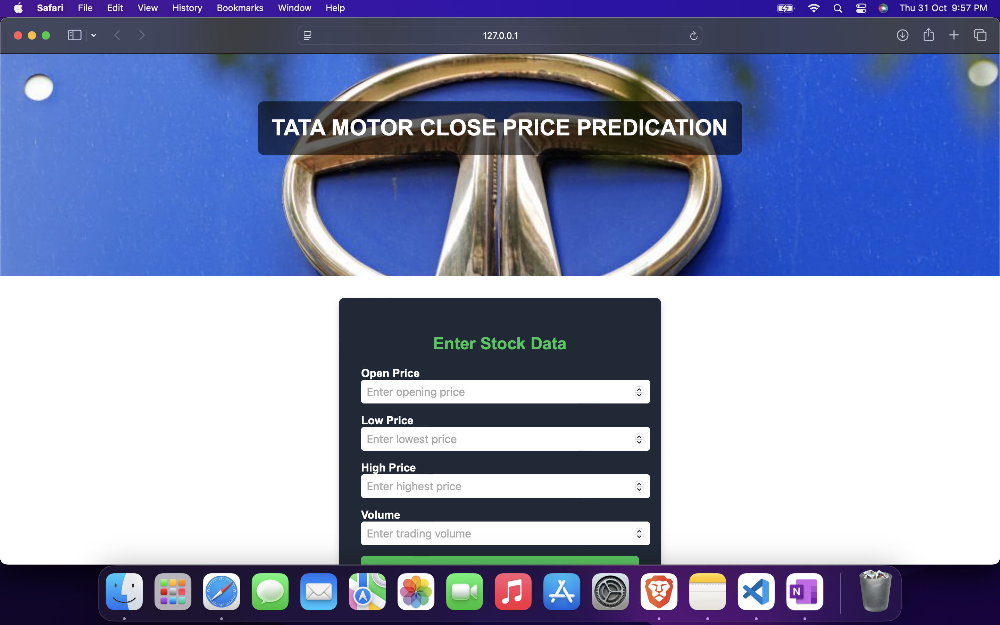

# Tata Motors Stock Price Prediction AI Model



## Overview
This project presents an AI-driven machine learning model designed to predict the closing price of Tata Motors stock based on historical data. By using a **Decision Tree Regressor**, this model provides reliable, data-driven forecasts to aid in stock market analysis and decision-making.

## Project Description
The model is trained on historical stock data downloaded from Yahoo Finance, which includes key features:
- **Open Price**: Opening price of the stock
- **Low Price**: Lowest price of the stock during the day
- **High Price**: Highest price of the stock during the day
- **Volume**: Total trading volume of the stock

The Decision Tree Regressor algorithm was chosen for its interpretability and strong performance on structured data. The trained model provides closing price predictions based on these features, making it valuable for both short-term trading and longer-term analysis.

## Data Collection
The historical stock data for Tata Motors was sourced from **Yahoo Finance** using the `yfinance` library and imported into a Jupyter Notebook (`.ipynb` file) for preprocessing and training. This setup allows for easy adjustments and updates to the model as more data becomes available.

### Sample Code for Data Collection
```python
import yfinance as yf

# Download Tata Motors stock data
data = yf.download('TATAMOTORS.NS', start='YYYY-MM-DD', end='YYYY-MM-DD')
